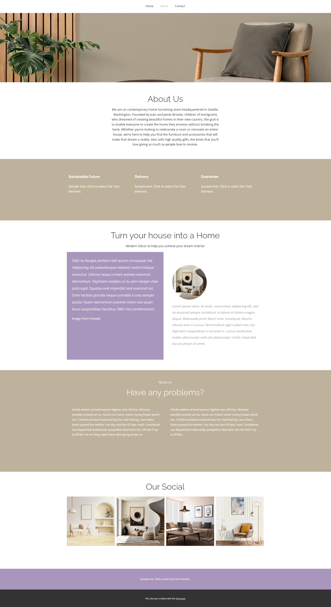

# Home Interior — About Page (CSS Project)

A multi-section interior design About page that includes:
- Navigation bar
- About Us section with hero background image
- Split content section with images and text
- Features row
- Social gallery section

Fully responsive design using pure CSS.

## 🔗 Live Demo
https://your-username.github.io/css-03-home-interior-about-page/

## 📸 Preview

## 🛠️ Tech Used
- HTML5
- CSS3 (Flexbox, responsive layout, spacing)

## 📂 Folder Structure
│── index.html  
│── style.css  
│── assets/  
|   └── screenshot.png  

## 🚀 How to Use
1. Clone:  git clone https://github.com/tayyab-balti/css-03-home-interior-about-page.git

2. Double-click `index.html` to run.
